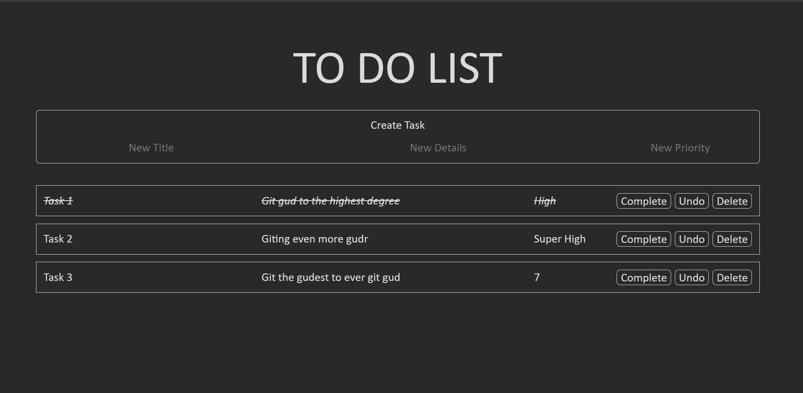

### Program Name: **_To-Do List_ Using GoLang, ReactJS, and MongoDB**

### Description:

A basic to-do list meant to be hosted offline. This application uses the below langauges/frameworks to host the application:

- ***GoLang*** as its backend
- ***ReactJS*** as its frontend
- ***MongoDB*** hosts the list data

The GoLang server is hosted on port 9000, MongoDB on port 27017, and ReactJS on its default of port 3000. When any update is triggered by the webpage ReactJS, sends an axios request to server 9000 which the GoLang is listening to. The GoLang server hears the request and makes the necessary changes to the MongoDB database and retrieves the updated task list. It then sends a response to ReactJS with the necessary data to update the webpage. 

Below are the operations you can preform with the webpage:
- ***Create*** a task
- ***Delete*** a task
- ***Complete*** a task
- ***Undo*** a completed task

### Visuals:
A video of the application in action can be found [here](https://youtu.be/TqdyqFx93-o)

The below is an image of the application:

### How to run the project:

- Download all files
- Start a MongoDB server hosted on local port 27017 and create a db named `TO_DO_LIST` with a collection name of `LIST`
- In a command line in the backend directory and type the following `go run main.go`
- In a command line in the frontend directory and type the following `npm start`
- Enjoy to your hearts content

*You will need to have all necessary languages and frameworks installed to run the application*